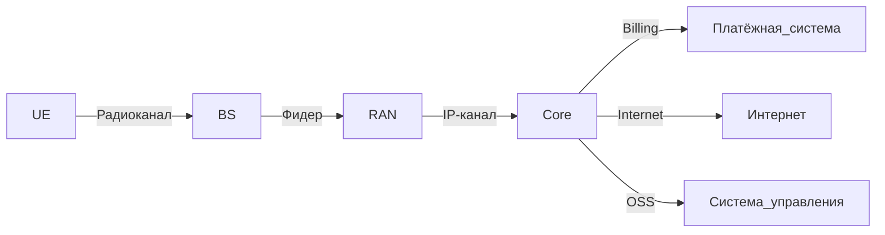

[[ОСМС Лекция 2.]]

---

## Что такое «Сота»?

- Обычно имеет шестиугольную форму (в теоретических моделях) — это обеспечивает равномерное покрытие без зазоров.
- Реальная форма — неправильная, зависит от рельефа, застройки, плотности абонентов.
- Типы сот:
  - Макросота (Macrocell) — радиус 1–30 км, вышки на крышах/мачтах.
  - Микросота (Microcell) — 0.1–1 км, в городских условиях.
  - Пикосота (Picocell) — до 200 м, внутри зданий.
  - Фемтосота (Femtocell) — до 10 м, домашние базовые станции..

---
## Базовая станция (БС)

- Устройство, которое **излучает сигнал** в пределах своей соты и **приём сигнала** от мобильных устройств.
- В разных поколениях называется по-разному:
  - **GSM**: BTS (Base Transceiver Station)
  - **UMTS**: Node B
  - **LTE**: eNodeB
  - **5G**: gNodeB

> *«БС — базовая станция, излучает сигнал, принимает сигнал»*

---
## Дуплексирование

Метод, позволяющий **одновременно передавать и принимать** данные между абонентом и БС.

### Два основных типа:

#### 1. FDD — Frequency Division Duplex
- Разные частоты для передачи и приёма.
- Пример: GSM, LTE FDD.

#### 2. TDD — Time Division Duplex
- Одна частота, но разные временные интервалы.
- Пример: TD-LTE, WiMAX, 5G TDD.

> *«FDD — разные частоты, TDD — одинаковые частоты, разные временные слоты»*

---

## Множественный доступ (Multiple Access, MA)

Метод, позволяющий **многим пользователям** совместно использовать общий радиоканал.

### Основные типы:

| Метод | Как работает | Пример |
|-------|--------------|--------|
| **FDMA** | Разделение по частоте | 1G (AMPS) |
| **TDMA** | Разделение по времени | GSM |
| **CDMA** | Разделение по коду | UMTS, CDMA2000 |
| **SDMA** | Разделение по пространству (направлению) | MIMO, Beamforming |
| **PDMA** | Разделение по мощности | Не используется широко |

> - FDMA — разные частоты для UE₁, UE₂...  
> - TDMA — временные слоты 1,2,3,4...  
> - CDMA — каждый пользователь использует свой код (code).  
> - SDMA — антенны направляют луч на конкретного абонента.
![[Excalidraw/ОСМС Лекция 2..md#^area=vMs5UztSvBS9nso5PE_Wo|800]]
---

## Архитектура сотовой сети

Сеть делится на две части:

### 1. RAN — Radio Access Network (Сеть радиодоступа)

- Отвечает за **радиосвязь** между UE и сетью.
- Состоит из:
  - **БС (Base Station)** — физическое оборудование.
  - **Контроллеры** (в 2G/3G): BSC, RNC — управление несколькими БС.
  - В LTE/5G — контроллеры объединены с БС (eNodeB/gNodeB).

> *«RAN = Radio Access Network»*  
> *«2G — GERAN, 3G — UTRAN, 4G — EUTRAN»*
![[Excalidraw/ОСМС Лекция 2..md#^area=15X3rGgyyOwF7SCpJ3X8c|800]]
---

### 2. Core — Ядро сети

- Отвечает за **коммутацию, учёт, авторизацию, подключение к другим сетям**.
- Состоит из:

#### a) Коммутатор / Шлюз (Gateway)
- Передаёт трафик между RAN и Core.
- В LTE: **SGW** (Serving Gateway), **PGW** (PDN Gateway).
- В 5G: **UPF** (User Plane Function).

#### b) Управляющее ядро (Control Plane)
- В 2G/3G: **MSC** (Mobile Switching Centre) — коммутация вызовов.
- В 4G: **MME** (Mobility Management Entity) — управление подвижностью.
- В 5G: **AMF** (Access and Mobility Management Function).

#### c) Home Subscriber Server (HSS)
- База данных абонентов — содержит IMSI, ключи, профили.

#### d) Billing — система учёта и оплаты
- Взимает плату за услуги (трафик, минуты, SMS).

#### e) OSS — Operation Support System
- Система управления сетью — мониторинг, настройка, диагностика.

---

## 🔗 Как всё соединяется?

> *«Может подключиться к кому хочет»* — это означает, что сеть может подключаться к любым внешним сетям (Интернет, телефония, другие операторы).  
> *«Взимает плату тыры пыры»*: биллинг считает, сколько ты потратил.

---
