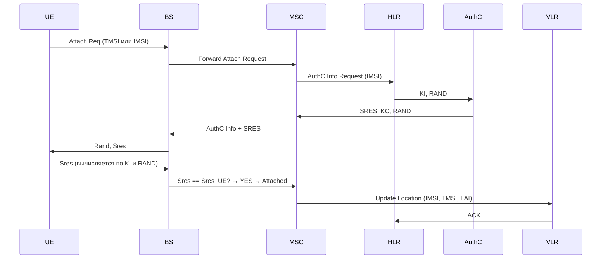
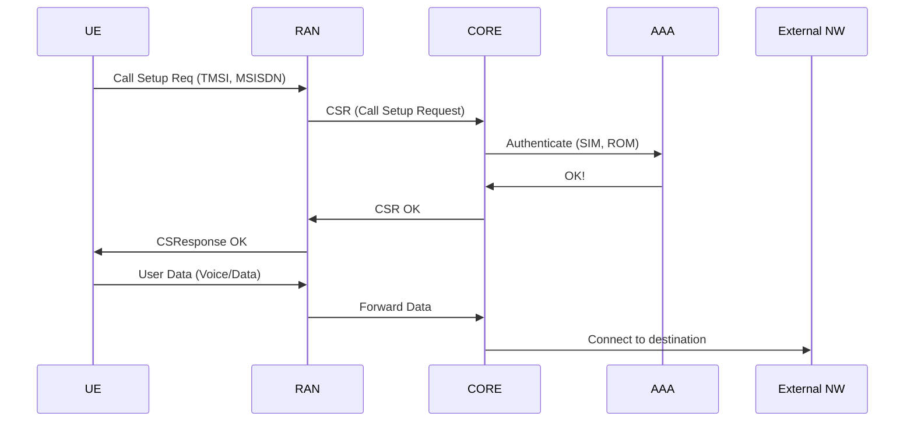
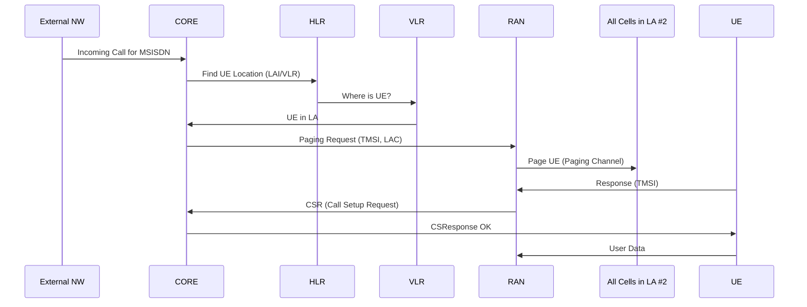
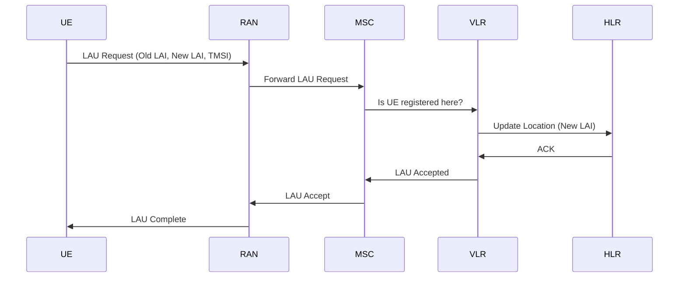

[[Lectures_drow_7]]

---

## 1. Регистрация в сети (Attach / Registration)

### Что это?
Процедура, при которой UE **регистрируется в сети** и получает доступ к услугам (голос, SMS, данные).

В 2G — называется **Attach**, в LTE — **EPS Attach**, в 5G — **Registration**.
![[Excalidraw/ОСМС Лекция 7..md#^area=S9ucD8kDZxESQHTWpyehW|800]]
![[Excalidraw/ОСМС Лекция 7..md#^area=EWScsGkcvisfm2FlL14Jy|800]]

---

### Процедура (на примере 2G GSM):

#### Ключевые элементы:
- **AAA** — Authentication, Authorization, Accounting (три A).
- **KI** — ключ идентификации (хранится в SIM и HLR).
- **RAND** — случайное число от сети.
- **SRES** — подпись ответа (вычисляется на основе KI и RAND).
- **A3/A8** — алгоритмы аутентификации и генерации ключа (в 2G).
- **TMSI (Temporary Mobile Subscriber ID)** — временный идентификатор, чтобы не передавать IMSI каждый раз (защита приватности).

> После успешной регистрации UE получает **TMSI** и записывается в **VLR** (Visitor Location Register).

---

## 2. Установление соединения (Call Setup / Service Request)

Разделяется на:
- **Исходящий вызов (Outgoing call / Originating call)** — UE инициирует вызов.
- **Входящий вызов (Incoming call / Terminating call)** — сеть инициирует вызов к UE.

---

### Исходящий вызов (Originating call)

![[Excalidraw/ОСМС Лекция 7..md#^area=ecT-dXhpC_Md92nK2ByQA|800]]
#### Что происходит:
- UE отправляет запрос на установление соединения.
- Сеть проверяет **права пользователя** (AAA).
- Если всё ок — выделяются ресурсы, начинается передача данных.

> В LTE/5G — вместо "Call Setup" используется **Service Request** (для данных), но логика аналогична.

---

### Входящий вызов (Terminating call)

![[Excalidraw/ОСМС Лекция 7..md#^area=nVEovX0X8MywUStMG38ks|800]]
> Важно: если UE **не отвечает на пейджинг** — вызов не устанавливается.

---

## 3. Пейджинг (Paging)

### Что это?
Механизм, с помощью которого **сеть находит UE**, который находится в режиме ожидания (idle mode), чтобы **доставить ему входящий вызов или SMS**.

---

### Как работает?

1. UE находится в **режиме idle** — не передаёт данные, но **прослушивает канал пейджинга**.
2. Когда приходит вызов — сеть отправляет **пейджинг-сообщение** в **все соты в текущей Location Area (LA)**.
3. UE, услышав свой TMSI — отвечает и переходит в **connected mode**.

> *«Раз в секунду — пол секунды, ус-во просыпается и слушает канал пейджинга на случай если ему звонят»*  
---

### Оптимизация: Location Area (LA)

- Чтобы не пейджить всю сеть — UE регистрируется в **Location Area (LA)** — группе сот.
- При перемещении между LA — UE делает **Location Update**.
- Размер LA — компромисс:  
  - Маленькая LA → много обновлений → высокая нагрузка на сигнальный канал.  
  - Большая LA → много пейджинга → высокая задержка и энергопотребление.

> - При увеличении числа сот в LA — **количество пейджинга растёт**, а **частота обновления местоположения падает**.

---

## 4. Обновление местоположения (Location Area Update, LAU)

### Зачем нужно?
Чтобы сеть знала, **в какой LA находится UE**, чтобы корректно доставлять пейджинг.

---

### Когда происходит:
- При **переходе между LA** (например, из LA #1 в LA #2).
- По истечении **таймера T3212** (обычно 30–60 минут) — периодическое обновление.
- При **включении телефона** (если LA изменилась).

---

### Процедура:

![[Excalidraw/ОСМС Лекция 7..md#^area=SOQNfjZN-gbPeitiSWeBG|800]]
> После LAU UE получает **новый TMSI** (для безопасности).

---

## Сравнение поколений

| Функция       | 2G (GSM)    | 3G (UMTS)   | 4G (LTE)    | 5G (NR)                   |
| ------------- | ----------- | ----------- | ----------- | ------------------------- |
| Регистрация   | Attach      | Attach      | EPS Attach  | Registration              |
| Идентификатор | IMSI/TMSI   | IMSI/TMSI   | IMSI/GUTI   | IMSI/5G-GUTI              |
| Пейджинг      | По LA (LAC) | По RA (RAC) | По TA (TAC) | По TA (TAC)               |
| Обновление    | LAU         | RAU         | TAU         | TAU / Registration Update |

> **TA = Tracking Area** — аналог LA в LTE/5G.

---

| Термин | Значение |
|--------|----------|
| **TMSI** | Временный идентификатор UE (для приватности) |
| **IMSI** | Уникальный идентификатор абонента (в SIM) |
| **LAU** | Обновление местоположения при переходе между LA |
| **Paging** | Поиск UE в режиме ожидания |
| **AAA** | Authentication, Authorization, Accounting |
| **SRES** | Подпись ответа на аутентификацию |
| **Kc** | Сессионный ключ шифрования (в 2G) |
