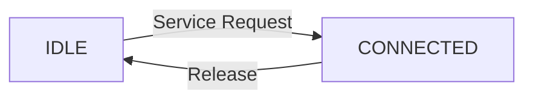
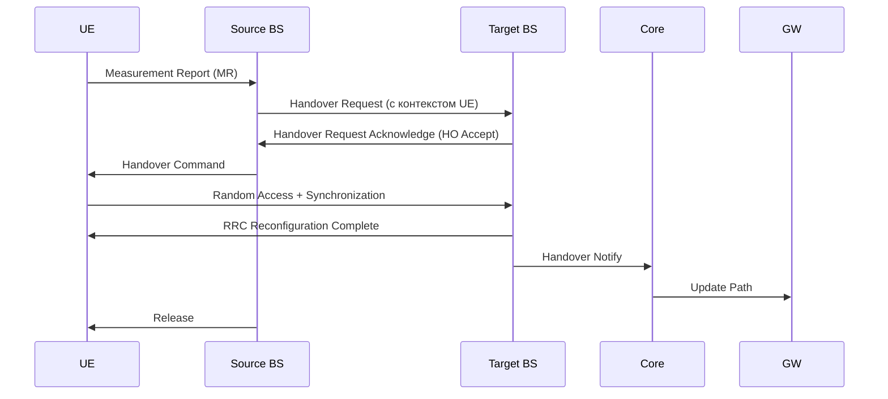

[[Lectures_drow_8]]

---

## 1. Состояния UE: IDLE vs CONNECTED

### Что это?
UE может находиться в одном из двух основных состояний:

| Состояние | Описание | Радиоресурсы | Пейджинг | Передача данных |
|-----------|----------|---------------|----------|------------------|
| **IDLE** | Устройство **не активно**, но зарегистрировано в сети. | Не выделены | Да — прослушивает канал пейджинга | Нет |
| **CONNECTED** | Устройство **активно**, установлено соединение. | Выделены (RRC-соединение) | Нет — не слушает пейджинг | Да |

---

### Переходы между состояниями

#### Важно:
- В **IDLE** — UE может делать **Cell Reselection** (выбор лучшей соты).
- В **CONNECTED** — UE делает **Handover** (переключение между сотами без разрыва соединения).
![[Excalidraw/ОСМС Лекция 8..md#^area=bDriOEfXn5LcOChVJcr7v|800]]

---

## 2. Хэндовер (Handover, HO)

### Что это?
Процедура **бесперебойного переключения UE** с одной соты (или БС) на другую **в режиме CONNECTED**.
![[Excalidraw/ОСМС Лекция 8..md#^area=fJ35Lh7IMLDM6BJOOysKm|800]]
> Без хэндовера — при движении ты бы терял связь каждый раз, когда покидаешь зону действия одной БС.

---

### Ключевые компоненты хэндовера

#### a) **Context (контекст UE)**
Информация, которую нужно передать от старой БС к новой:

- **UE ID** (например, RNTI — Radio Network Temporary ID),
- **Ключи шифрования** (Kc, K1),
- **IP-адрес** (IPv4/IPv6),
- **Параметры QoS, PDP-контексты** (в 3G/4G).

#### b) **Source BS** — текущая базовая станция.
#### c) **Target BS** — новая базовая станция.
#### d) **Core Control Unit** — центр управления (MSC, MME, AMF).
#### e) **GW (Gateway)** — шлюз, через который идёт трафик.
![[Excalidraw/ОСМС Лекция 8..md#^area=wNb8qlImpNmXVMPBSnpuw|800]]

---

## 3. Процесс хэндовера (по шагам)

Вот как это происходит (на примере LTE/5G):

![[Excalidraw/ОСМС Лекция 8..md#^area=nyY8CVQFhZ0r0qH4fIrqU|800]]
---

## 4. Измерения сигнала и триггеры хэндовера

### Как UE решает, пора ли переходить?

UE постоянно измеряет **уровень сигнала** от своей **текущей соты (Serving Cell)** и **соседних сот (Neighbor Cells)**.

![[Excalidraw/ОСМС Лекция 8..md#^area=8rMI0akLdaZsWhP18vFBu|800]]
#### 🔹 Threshold 1:
- Измеряем только **текущую соту**.
- Если сигнал упал ниже -105 дБм → возможно, нужен хэндовер.

#### 🔹 Threshold 2:
- Измеряем **текущую и соседнюю** соту.
- Если соседняя лучше — отправляем **Measurement Report (MR)**.
- Но ждём **TTT (Time To Trigger)** — чтобы не переключаться из-за кратковременного провала.

> TTT — задержка, чтобы избежать "дрожания" (ping-pong handover).

#### 🔹 Threshold 3:
- Если нет подходящей соты в текущей технологии — ищем **другие технологии** (например, 3G → 2G).

---

### Пример с графика:
- Сигнал текущей соты (красная линия) падает,
- Сигнал соседней (синяя) растёт,
- Когда они пересекаются — и прошло TTT → **хэндовер запускается**.

> Даже если соседняя сота **теоретически лучше**, но **не достигла порога** — хэндовер не произойдёт.

---

## 5. Классификация хэндоверов

### По типу перехода:

| Тип | Описание |
|-----|----------|
| **Intra-RAT** | Внутри одной технологии (например, LTE → LTE) |
| **Inter-RAT** | Между разными технологиями (LTE → UMTS, 5G → Wi-Fi) |

### По уровню:

- **Intra-cell** — внутри одной соты (редко, обычно для балансировки нагрузки).
- **Inter-cell** — между сотами.
- **Inter-BS** — между базовыми станциями.
- **Intra-frequency** — на той же частоте.
- **Inter-frequency** — на другой частоте.

### По методу:

- **Hard Handover** — разрыв соединения → установление нового (например, GSM → UMTS).
- **Soft Handover** — одновременная работа с двумя БС (CDMA, UMTS).
- **Softer Handover** — внутри одной БС (между секторами).
![[Excalidraw/ОСМС Лекция 8..md#^area=-WzUcO4yvANzk7NWIIhZ4|800]]

---

## 6. Роль RNTI и временных идентификаторов

- **RNTI (Radio Network Temporary ID)** — временный идентификатор UE в радиосети.
- При хэндовере:
  - Старая БС передаёт **RNTI и ключи** новой БС.
  - Новая БС выдаёт **новый RNTI** (опционально).
- Это позволяет **не терять сессию** и **не перезапускать аутентификацию**.

> *«БС даёт ус-ву временный идентификатор»*

---

| Термин | Значение |
|--------|----------|
| **IDLE** | Режим ожидания, пейджинг, Cell Reselection |
| **CONNECTED** | Активное соединение, хэндовер, передача данных |
| **RNTI** | Временный идентификатор UE в радиосети |
| **TTT** | Time To Trigger — задержка перед хэндовером |
| **Measurement Report** | Отчёт UE о качестве соседних сот |
| **Intra-RAT** | Хэндовер внутри одной технологии |
| **Inter-RAT** | Хэндовер между технологиями (LTE→Wi-Fi, 5G→3G) |
| **Hard HO** | Разрыв соединения → новое соединение |
| **Soft HO** | Одновременная работа с двумя БС |
